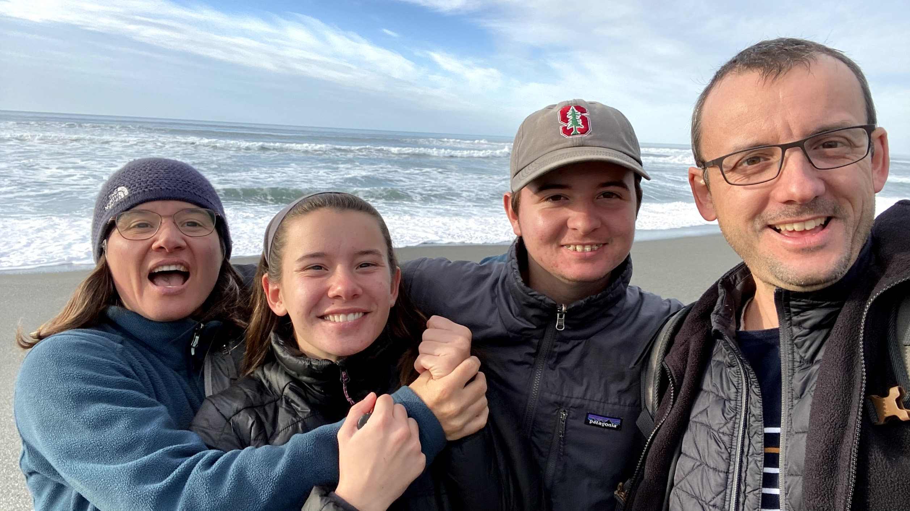
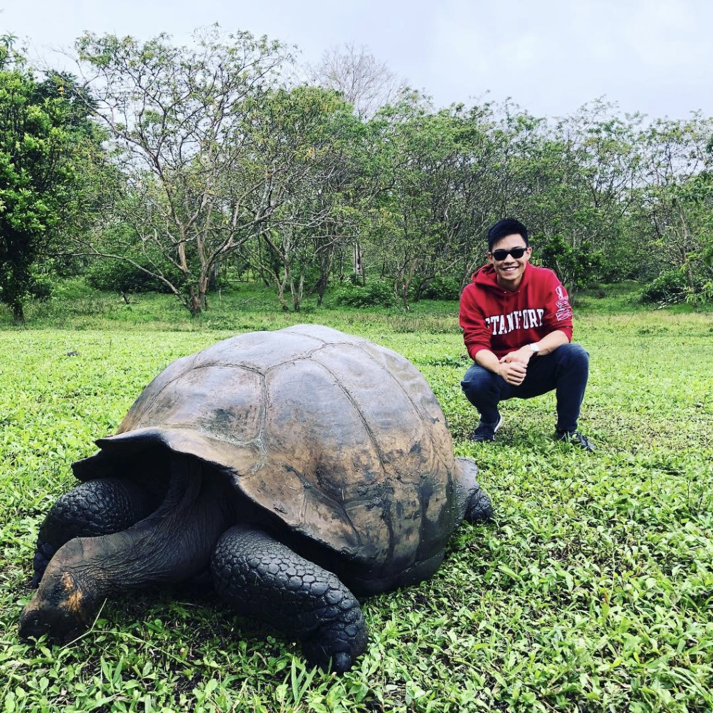
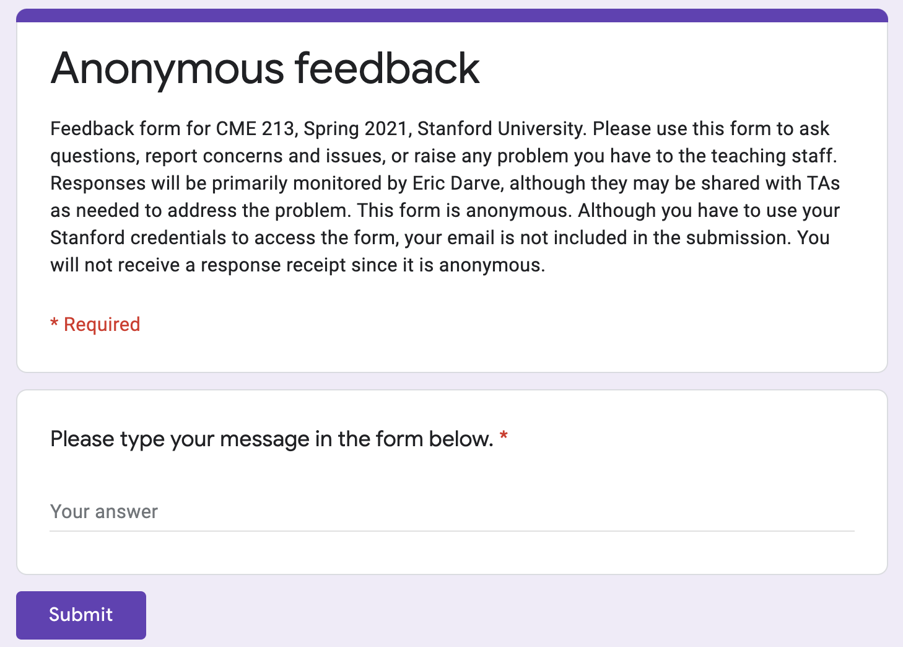
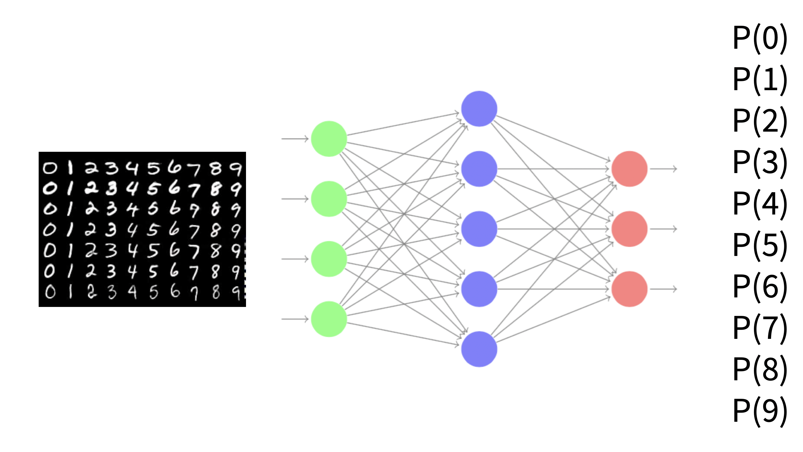
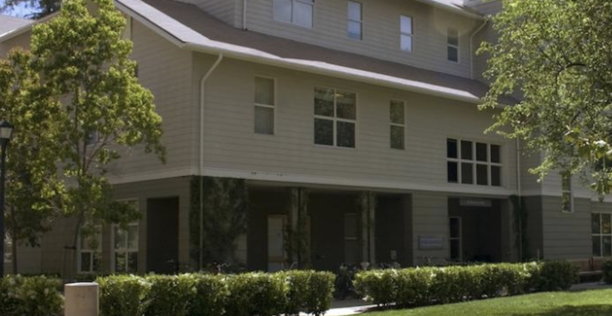

class: center, middle

# CME 213, ME 339&mdash;Winter 2021 Introduction to parallel computing using MPI, openMP, and CUDA

## Eric Darve, ICME, Stanford

"The city's central computer told you? R2D2, you know better than to trust a strange computer!" (C3PO)

---
class: center, middle

# Instructor

Eric Darve, ME, ICME, darve@stanford.edu

Numerical linear algebra, machine learning for mechanics and engineering, parallel computing 

 &nbsp;&nbsp;&nbsp; 

---
class: center, middle

# Teaching assistant

Chenzhuo Zhu (head TA)

---
class: center, middle

.pull-left[]
.pull-right[# Teaching assistant

Vikul Gupta]

---
class: center, middle

# Guest lectures

[Elliott Slaughter](https://elliottslaughter.com/) &nbsp;&nbsp;&nbsp; 

NVIDIA engineers &nbsp;&nbsp;&nbsp; 

---
class: center, middle

Classes will be (mostly) pre-recorded using Panopto.

There will be a few live lectures (tutorials, guest lectures).

Recordings can be found on the class web page.

---
class: center, middle

# **C++ refresher** with Chenzhuo

This Wednesday 2:30 PM over live Zoom

---
class: center, middle

# Canvas

https://canvas.stanford.edu/courses/133903

Announcements, grades, office hours, zoom links

---
class: middle

# Office Hours

See Zoom tab on Canvas (sessions are not recorded)

- Monday 2&ndash;4 PM: instructor
- Tue 4&ndash;6 PM: Chenzhuo
- Wed 9&ndash;11 AM: Vikul
- Thu 4&ndash;6 PM: Chenzhuo
- Fri 9&ndash;11 AM: Vikul

---
class: center, middle

# Class web page

https://ericdarve.github.io/cme213-spring-2021/

Class material, homework, reading assignments, final project

[Syllabus](https://ericdarve.github.io/cme213-spring-2021/syllabus)

---
class: center, middle

# How to get support? 

Online discussion forum on Slack

https://cme213-spring-2021.slack.com/

 Channel: `#homework`

---
class: center, middle

Please be civil on the forum

No disrespectful or demeaning posts

---
class: middle

# Gradescope

https://www.gradescope.com/courses/258024

See entry code on Canvas.

- Grades and rubrics
- Regrades

---
class: middle

# Assignment weights

- Reading assignments: 25%
- Homework: 40%
- Final project: 35%

---
class: middle

- Reading assignments: questions on the lecture videos
- Homework assignments: more in-depth programming assignments

---
class: center, middle

Usually, reading assignments are due on Wednesday and homework assignments are due on Friday.

---
class: middle

# Homework submission

- PDF with answers: gradescope
- Computer code: copy your code to .red[`cardinal`]. A Python script is provided for the submission. Instructions are given in the homework assignment.

---
class: center, middle

## Policy for late assignments

Extensions can be requested in advance for exceptional circumstances (e.g., travel, sickness, injury, COVID-related issues) and for .red[OAE-approved accommodations.]

Submissions after the deadline and late by at most .red[two days] will be accepted with a 10% penalty. 

No submissions will be accepted two days after the deadline.

---
class: center, middle

# Anonymous feedback

Google form; see Canvas for the link

---
class: center, middle

# Ice breaker

---
class: middle

- Break into groups. Minimum: 3. Maximum: 5.
- If interested this group may become your study group for this quarter.
- You will have 10 minutes to complete the exercise.

---
class: middle

.small[In your group, introduce yourself: give your name, major, and degree. Then answer the following questions, one per round.

1. Would you rather travel back in time to meet your ancestors or would you rather go to the future to meet your descendants?
2. Is it ever OK to waste time?
3. Describe an experience in your life that changed your values.

.red[Make a note of these questions before leaving the lobby.]

Group size: min: 3; max: 5. Time: 10 minutes
]

---
class: center, middle

# Final Project

Deep neural network to recognize hand-written digits ([MNIST](http://yann.lecun.com/exdb/mnist/))

Will involve CUDA and MPI programming

---
class: center, middle

---
class: center, middle

# DNN playground

https://playground.tensorflow.org/

---
class: center, middle

AlphaGo played a handful of highly inventive winning moves, several of which were so surprising they overturned hundreds
of years of received wisdom.

---
class: center, middle

# Deep Learning relies on parallel computing

Program | Hardware
--- | ---
AlphaGo Fan | 176 GPUs
AlphaGo Lee | 48 TPUs
AlphaGo Master | Single machine with 4 TPUs
AlphaGo Zero | Single machine with 4 TPUs

---
class: middle

# Computer access

- ICME computer cluster: `icme-gpu.stanford.edu`
- This computer has GPUs which will be required for the GPU homework assignments and the final project. 
- For the first few assignments, you can use your own computer or one of the computers on [FarmShare](https://uit.stanford.edu/service/sharedcomputing/environments).
- `rice.stanford.edu` is a good option.

---
class: center, middle

# Books!

Available electronically 

http://searchworks.stanford.edu/

---

.pull-left[]

.pull-right[## General parallel computing books
Parallel Programming for Multicore and Cluster Systems, by Rauber and R&uuml;nger

Applications focus mostly on linear algebra]

---

.pull-left[]
.pull-right[Introduction to Parallel Computing, by Grama, Gupta, Karypis, Kumar

Wide range of applications from sort to FFT, linear algebra and tree search
]

---

.pull-left[]
.pull-right[An introduction to parallel programming, by Pacheco

More examples and less theoretical

Applications include N-body codes and tree search
]

---

.pull-left[]
.pull-right[## OpenMP and multicore books

Using OpenMP: portable shared memory parallel programming, by Chapman, Jost, van der Pas

In-depth coverage of OpenMP
]

---

.pull-left[]
.pull-right[The art of multiprocessor programming, by Herlihy, Shavit

Specializes on advanced multicore programming
]

---

.pull-left[]
.pull-right[Using OpenMP&mdash;The Next Step: Affinity, Accelerators, Tasking, and SIMD, by van der Pas, Stotzer, Terbo

Covers recent extensions to OpenMP and some advanced usage
]

---

# CUDA&mdash;online documentation **(preferred)**

Programming guides and API references http://docs.nvidia.com/cuda/index.html

Teaching and learning resources from NVIDIA https://developer.nvidia.com/cuda-education-training

Recommended reading (also on class page):
- [CUDA_C_Best_Practices_Guide.pdf](http://docs.nvidia.com/cuda/pdf/CUDA_C_Best_Practices_Guide.pdf)
- [CUDA_C_Programming_Guide.pdf](http://docs.nvidia.com/cuda/pdf/CUDA_C_Programming_Guide.pdf)

---

.pull-left[]
.pull-right[## CUDA books

Professional CUDA C Programming, by Cheng, Grossman, McKercher

**Recommended for this class;** has more advanced usage like multi-GPU programming
]

---

.pull-left[]
.pull-right[Programming Massively Parallel Processors: A Hands-on Approach, by Kirk, Hwu

In its 3rd edition now; covers a wide range of topics including numerical linear algebra, applications, parallel programming patterns
]

---

.pull-left[]
.pull-right[CUDA Handbook: A Comprehensive Guide to GPU Programming, by Wilt

Lots of advanced technical details on memory, streaming, the CUDA compiler, examples of CUDA optimizations
]

---

.pull-left[]
.pull-right[CUDA Programming: A Developer's Guide to Parallel Computing with GPUs, by Cook

Extensive CUDA optimization guide; practical tips for debugging, memory leaks
]

---

.pull-left[]
.pull-right[## MPI books

Parallel Programming with MPI, by Pacheco

Classic reference; somewhat dated at this point
]

---

.pull-left[]
.pull-right[Using MPI: Portable Parallel Programming with the Message-Passing Interface, by Gropp, Lusk, Skjellum

Very complete reference
]

---

.pull-left[]
.pull-right[Using Advanced MPI: Modern Features of the Message-Passing Interface, by Gropp, Hoefler, Thakur, Lusk

Same authors as previous entry; discusses recent and more advanced features of MPI
]

---
class: center, middle

# What this class is about

Multicore processors; Pthreads, C++ threads, OpenMP

NVIDIA graphics processors using CUDA

Computer clusters using MPI

---
class: center, middle

Numerical algorithms for illustration

Sort, linear algebra, basic parallel primitives

---
class: center, middle

# What this class is **not** about

Parallel computer architecture

Parallel design patterns and programming models

Parallel numerical algorithms

---
class: middle

# Other related classes

- *CME 342: Parallel Methods in Numerical Analysis;* parallel algorithms
- *CS 149: Parallel Computing;* hardware, synchronization mechanisms, parallel programming models

---
class: middle

- *EE 382A: Parallel Processors Beyond Multicore Processing;* SIMD programming, parallel sorting with sorting networks, string comparison with dynamic programming, arbitrary-precision operations with fixed-point numbers

---
class: middle

# Requirements and pre-requisites

**Basic knowledge of UNIX**

ssh, compilers, makefile, git

---
class: middle

**Knowledge of C and C++**

Pointers, memory, templates, standard library, .grey[polymorphism]

---
class: middle

General proficiency in scientific programming

**Testing, verification, and debugging**

---
class: middle

**Respect for diversity**

.small[It is my intent that students from all diverse backgrounds, perspectives, and situations be .red[well served] by this course, that students’ .red[learning needs] be addressed both in and out of class, and that the diversity that students bring to this class be viewed as a .red[resource, strength, and benefit.]

It is my intent to present materials and activities that are .red[respectful of diversity.]

I acknowledge that there is likely to be a diversity of .red[access to resources] among students and plan to support all of you as best as I can. 

Please .red[let me know of ways to improve] the effectiveness of the course for you personally or for other students or student groups.]

---
class: middle

.small[*COVID! Politics! Capitol riot!*

Many reasons to be stressed, anxious, and on edge.

You may experience a range of other challenges that can cause barriers to learning, such as strained relationships, increased anxiety, alcohol/drug problems, feeling down, difficulty concentrating and/or lack of motivation. 

Stanford is committed to advancing the .red[mental health and well-being of its students.] If you or someone you know is feeling overwhelmed, depressed, and/or in need of support, services are available.
Confidential mental health services: [Vaden service site](https://vaden.stanford.edu/caps)]

.center[
]

---
class: center, middle

# Students with Documented Disabilities

Office of Accessible Education (OAE)

563 Salvatierra Walk; 723-1066

http://oae.stanford.edu

**Let us know right away!**

---
class: middle

### Honor Code and Office of Community Standards

Violations include at least the following circumstances: copying material from 
- another student,
- previous year solution sets,
- solutions found on the internet

.pull-left[.red[All work must be your own!] 
[Honor Code](https://communitystandards.stanford.edu/policies-and-guidance/honor-code)]
.pull-right[.center[]]

---
class: middle, center

Do not post any solution set from this class online

.center[]

---
class: middle, center

If found guilty of a violation, your grade will be automatically lowered by at least one letter grade, and the instructor may decide to give you a "No Credit" grade.

.center[]

---
class: center, middle

## Survey 

Please go to [Canvas](https://canvas.stanford.edu/courses/133903) to fill the online survey.